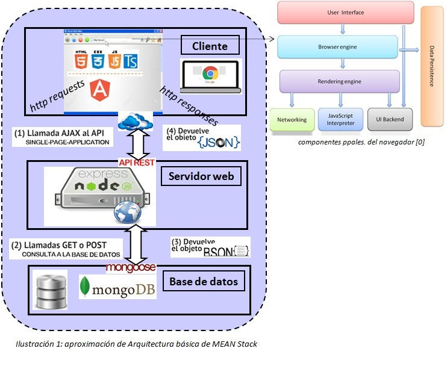
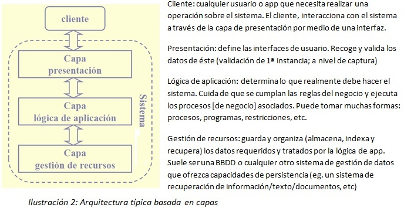
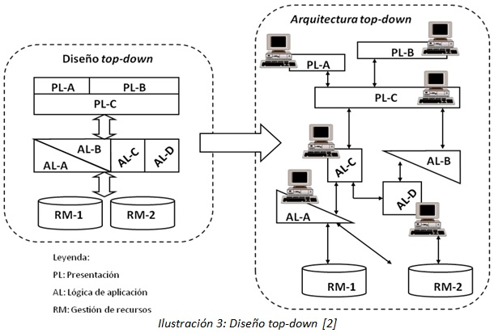

# mean-stack-intro
####Batería incremental de ejemplos introductorios a [MEAN](http://mean.io/) (MongoDB, Express.js, AngularJS y Node.js)
#####Autoría:
- Ruben Gómez García (autor del código)
- Rafael Delgado Casanova (autor del código de las carpetas de refuerzo)

#####Editor de código: [MS Visual Studio Code](https://code.visualstudio.com/)
#####Tecnologías usadas del lado cliente:
- [HTML5](http://www.w3schools.com/html/default.asp), [CSS3](http://www.w3schools.com/css/default.asp), [Bootstrap](http://getbootstrap.com/), [JavaScript ES6](http://www.ecma-international.org/ecma-262/6.0/), [Typescript](https://www.typescriptlang.org), [jQuery](https://jquery.com/), [Ajax](http://api.jquery.com/category/ajax/) y [JSON](http://www.json.org/)
- *Front-end framework*: [Angular 2](https://angular.io/)  

#####Tecnologías lado servidor:
- [nodejs](https://nodejs.org/en/)
- [expressjs](http://expressjs.com/)
- [mongoosejs](http://mongoosejs.com/)  

#####Tecnologías de base de datos:
- [mongoDB](https://www.mongodb.com/)
  

###Aclaraciones
Las líneas que siguen, son un compendio de información para situar al usuario en un nivel de abstracción, que se entiende necesario, antes de "aterrizar" en el plano operativo.  
Para facilitar la lectura, al final, se ha añadido un apdo. de glosario y acrónimos, y otro de referencias. Se recomienda su consulta. Igualmente, se mantienen ciertos términos sin traducir, para no desvirtuarlos.  
Las recomendaciones que se puedan dar, van orientadas a la utilización óptima de los recursos, las buenas prácticas de programación de acuerdo a sus paradigmas, el cumplimiento de estándares y, no menos importante, la experiencia. Dichas recomendaciones, no deben tomarse como universarles.  
###Introducción
Aunque variadas son las disciplinas en el campo de la Ingeniería de Software, algún grado de relación hay entre ellas. Surge aquí, unos de los primeros conceptos importantes de la IS: acoplamiento.  
Citamos algunas, no todas, de las disciplinas que abarca la IS:  
- **Tecnologías de la web (donde nos centraremos)**
- Computación distribuida
- Ingeniería de requisitos
- Arquitectura software y *Model Driven Architecture (MDA)*
- *Software Reliability Methods*
- Diseño de interfaces de usuario (ingeniería de la interfaz o IPO)
- Mantenimiento y gestión del cambio
- Tecnologías de integración
- Tecnologías de recuperación de información
- Tecnologías de minería de datos y tecnologías de minería de textos  
  
Por tanto, el problema fundamental al que se enfrenta el programador es la diversidad de tecnologías, su complejidad y cómo éstas se relacionan.  
###Alcance
Se circunscribe a las tecnologías de la web y, más concretamente, al desarrollo de apps web SPA sobre el *framework MEAN Stack*; no siendo aquí necesarias cuestiones de usabilidad y rendimiento (que si lo son en apps del mundo real)
###Princípios generales de diseño
####I. Arquitectura Software basada en capas
Arquitectura que, desde el punto de vista de su estructura, se basa en capas y, según su topología, es centralizada (jerárquica, multi-capa ó *n-tier* -son una generalización del paradigma cliente/servidor-) donde los componentes del sistema presentan distintos roles [1].  

####II. Diseño *top-down* (de arriba abajo o descendente)
Orientado al desarrollo de nuevos sistemas, desde su origen, y donde los componentes no actúan de manera aislada. Como podemos observar, los componentes, aún siendo independientes, tienen un alto grado de cohesión o acoplamiento funcional (1); es decir, parte de un elevado grado de homogeneidad pues el sistema se diseña para ser distribuido desde el inicio. Diferencia ésta, frente al enfoque *bottom-up*, aplicable cuando los sistemas ya existen, son estancos, y no puedan ser reemplazados con facilidad (sistemas *legacy* o heredados)  

(1) no confundir aquí el concepto de acoplamiento con el habitualmente empleado en IS.
####III. Modelo basado en componentes
Los componentes se diseñan siguiendo el modelo de AASS basada en subsistemas y añadiendo criterios de SSDD. Consiste en múltiples componentes que encapsulan cierta información. Un componente esta formado por otros componentes, un objeto simple o múltiples objetos. Ofrecen una interfaz (la de los *wrappers*), independiente de la implementación, para comunicarse con otros componentes usando patrones de comunicación [3].  
Que los componentes sean usados para gestionar el sistema, a parte de reproducir la AASS de apps administradas como un conjunto de componentes, permiten adaptar dinámicamente estas apps a los cambios del entorno [4]. Por tanto, esta característica, contribuye sobremanera a alcanzar otro de los principios fundamentales de la IS: la reutilización.
###Glosario
**Acoplamiento**: grado de interdependencia entre dos o más componentes SW o sistemas HW.  
**App o sistema (en todo el documento)**: se referirá a nuestra aplicación web SPA.  
**Arquitectura Software (AASS)**: base para una correcta implementación del sistema. Implica la estructuración de sus componentes, cómo éstos interactúan y la estructura propia de datos que usan.  
Desde el nivel más alto de abstracción, nos situa en el plano estratégico que hace posible alineación negocio/tecnología, estableciendo un puente entre los requisitos y el diseño [5].  
**BBDD (Base de datos)**: Repositorio de almacenaje y estructuración de datos. Garantiza la persistencia de un sistema, eso es, que los datos permanezcan en el tiempo.  
**Cluster**:  agrupamiento de servidores para aumentar la disponibilidad de servicio de un sistema. Cuando decimos que n-servidores son "clusterizables", es lo mismo que decir n-servidores en alta disponibilidad.    
***Framework***: entorno estandarizado de trabajo para abordar una problemática concreta, como pueda ser un desarrollo SW o la representación de una AASS.      
**IS**: Ingeniería de Software. De manera simplona, campo de la informática que se encarga de aquello que no es tangible y, por ende, difícilmente medible; básicamente, el SW. Más formal, podríamos acercanos a la definición de la IEEE: "*aplicación de una estrategia sistemática, planificada y controlable (en lo posible) para el desarrollo, explotación y mantenimiento del software.*"  
**IPO**: (interacción persona-ordenador). Proceso de diseño de sistemas interactivos centrados en el usuario [6].  
**SPA** (*Single-page application*): interfaz web de página única, compuesta de componentes individuales, modificables y/o sustituibles y, por consiguiente, evita la renderización a cada interacción del usuario con la app [7]. Lectura recomendada [8]  
**SSDD**: sistema o entorno de computación distribuido. Conjunto de computadores, interconectados mediante una red, que comparten un estado global y parecen ser usados como un único sistema (ofrecen una visión de sistema único, *Single System Image o SSI*) [9]  
**Sistema heredado**: sistema fundamental para la organización, creado hace tiempo, al que se han ido adaptando otros a su alrededor (monolítico/inextensible) y que, en la actualidad, se usa en un contexto distinto para el que fue diseñado.  
**Usabilidad**: orientada a que el usuario tenga facilidad en el manejo de la app (con ausencia de incomodidad) y un elevado grado de satisfacción.  
***Wrapper***: usados en procesos de integración como bloques de contrucción básicos (*building blocks*). Elemento que proporciona una puerta de entrada a la app con la que se pretende interactuar. El acceso puede ser: a través de una interfaz (vía API “programática”), atacando directamente a la BBDD de la app, o bien, a través de una tabla de servicios proporcionada por la propia app.  
###Referencias
Se recogen a modo de citas, siguiendo la guía de estilo y especificaciones de la asociación IEEE.  
  
[0] T. Garsiel, "How browsers work [on-line]", Tali Garsiel's site, accedido en oct. 2016, disponible [aquí](http://taligarsiel.com/Projects/howbrowserswork1.htm)  
[1] J.M. Martín Ramos, "Tema 1. Introducción a los SSDD", Apuntes asignatura SSDD, Dpto. de TI de la ETSI, UHU, 2014.  
[2] G. Alonso, "Chapter 1: Distributed Information Systems [on-line]", Swiss Federal Institute of Technology, acceso jun. 2014, disponible [aquí](http://www.inf.ethz.ch/personal/alonso/teaching.html)  
[3] A.J. Suárez Fábrega, "Tema 1: AASS basada en componentes", Apuntes asignatura ASDM, Dpto. de TI de la ETSI, UHU, 2014.  
[4] S. Sicard, F. Boyer and N. De Palma, "Using Components for Architecture-Based Management: The Self-Repair case." in *Proc. Int’l Conference on Software Engineering (ICSE)*, 2008.  
[5] D. Garlan "From Software Programming to Software Engineering" in *I Congreso internacional de Ingeniería de software para Grandes corporaciones*, Huelva, 2013.  
[6] N. Pavón Pulido, "Tema 1: IPO", Apuntes asignatura Diseño de Interfaces de usuario, Dpto. de TI de la ETSI, UHU, 2013.  
[7] A. Mesbah and A. van Deursen, "Migrating multi-page web apps to single-page ajax interfaces." in Delft University of Technology, Technical Rep., TUD-SERG-2006-018 2nd rev., pp. 1, 2006.  
[8] M.A. Álvarez Sánchez, "Qué es una SPA [on-line]", DesarrolloWeb.com web page, accedido en dic. 2016, disponible [aquí](http://www.desarrolloweb.com/articulos/que-es-una-spa.html)  
[9] J.M. Martín Ramos, "Tema 2. Arquitectura de los SSDD", Apuntes asignatura SSDD, Dpto. de TI de la ETSI, UHU, 2014.  

