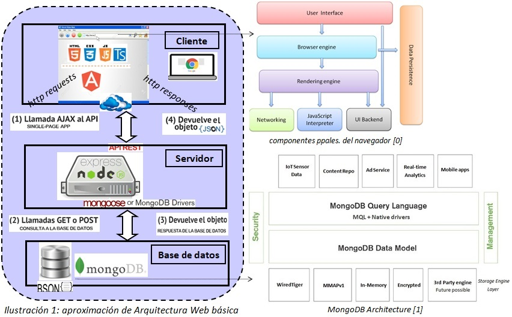

# web-stack-intro
### Batería de ejemplos introductorios de Tecnologías Web  
#### Autores:  
- Ruben Gómez García (autor del código, proveniente de https://github.com/kaneproject/mean-stack-intro)
- Rafael Delgado Casanova (adaptador y autor del código de refuerzo salvo los *fuente* aludidos)

#### Editor de código: [MS Visual Studio Code](https://code.visualstudio.com/)  
#### Tecnologías usadas del lado cliente:  
- [HTML5](http://www.w3schools.com/html/default.asp), [CSS3](http://www.w3schools.com/css/default.asp), [Bootstrap](http://getbootstrap.com/), [JavaScript ES6](http://www.ecma-international.org/ecma-262/6.0/), [Typescript](https://www.typescriptlang.org), [jQuery](https://jquery.com/), [Ajax](http://api.jquery.com/category/ajax/)
- *Front-end framework*: [Angular 2](https://angular.io/)  

#### Tecnologías aplicadas del lado servidor:  
- [nodejs](https://nodejs.org/en/)
- [expressjs](http://expressjs.com/)
- [mongoosejs](http://mongoosejs.com/)  

#### Tecnologías de base de datos:
- [mongoDB](https://www.mongodb.com/)
  

  
[0] T. Garsiel, "How browsers work [on-line]", Tali Garsiel's site, accedido en oct. 2016, disponible [aquí](http://taligarsiel.com/Projects/howbrowserswork1.htm)  
[1] "MongoDB 3.4 Architecture Guide [on-line]", MongoDB Inc., Nov. 2016, accedido en nov. 2016, disponible [aquí](https://www.mongodb.com/mongodb-architecture)  